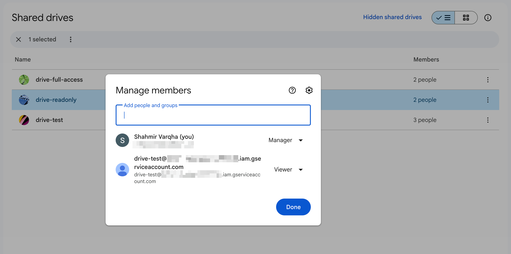

# Contributing to gdrive-fsspec

Thanks for your interest in contributing! This guide covers local setup, running tests, and the checks CI runs on pull requests.

## Prerequisites

Install `uv` and `pre-commit`:

- [`uv` install docs](https://docs.astral.sh/uv/getting-started/installation/)
- [`pre-commit` install docs](https://pre-commit.com/#install)

## Setup

1. Fork the repository on GitHub, then clone your fork:

   ```sh
   git clone git@github.com:<your-username>/gdrive-fsspec.git
   cd gdrive-fsspec
   ```

2. Create the virtual environment and install dependencies:

   ```sh
   uv sync --all-groups
   ```

3. Install pre-commit hooks:

   ```sh
   pre-commit install
   ```

## Running checks locally

CI runs the same checks you can run before pushing:

**Lint** (ruff, codespell, formatting, and more via pre-commit):

```sh
pre-commit run --all-files
```

**Type checking** (pyrefly):

```sh
uv run pyrefly check
```

**Unit tests** (default; no Google Drive credentials needed):

```sh
uv run pytest -v
```

**Coverage** (same unit tests; reports missing lines; CI requires at least 95%):

```sh
uv run pytest --cov=gdrive_fsspec --cov-report=term-missing
```

## Docstrings

Use reStructuredText (RST) double backticks for inline code in docstrings—for example, ``drive`` rather than `drive`. This matches the existing codebase and renders correctly with Sphinx-style tooling.

## Integration tests

Integration tests use a real Google Drive account and a directory named `gdrive_fsspec_testdir` on Drive.

```sh
uv run pytest -v -m integration
```

By default, the tests trigger a browser login to authenticate. However, you can also use service-account credentials.

Hence, we dedicate a **profile** to each method of testing. Each profile targets a different drive and has different roles. Any profile whose variables are unset is skipped, so you can run a subset locally.

| Profile | Auth | Target | Access | Exercises |
| --- | --- | --- | --- | --- |
| `full_access` | service account | shared drive | Manager | Full CRUD (the default `fs` fixture when a key is set) |
| `content_manager` | service account | shared drive | Content manager | Trash allowed; permanent delete denied |
| `readonly` | service account | shared drive | Viewer | Reads allowed; all mutations denied |
| `sa_my_drive` | service account | _none_ (SA My Drive) | — | No quota; uploads must fail |
| `user` | user OAuth | My Drive | user | Full CRUD as a real user (the default `fs` fixture when no key is set) |

Set these environment variables before running them:

- `GDRIVE_FSSPEC_CREDENTIALS_PATH` — path to a service-account JSON, or the JSON string (starting with `{`). Shared by every service-account profile. **Its presence also picks the default `fs`/`make_fs` identity:** set → full-access service account; unset → OAuth user.
- `GDRIVE_FSSPEC_DRIVE_FULL_ACCESS` — **Shared Drive** (name or ID) where the service account has **Manager** access.
- `GDRIVE_FSSPEC_DRIVE_CONTENT_MANAGER` — _optional_. Shared Drive where the service account has **Content manager** access.
- `GDRIVE_FSSPEC_DRIVE_READONLY` — _optional_. Shared Drive where the service account has **Viewer** access. Add a file to it manually to exercise the trash-denied path.

<p align="center">
  
</p>

The `sa_my_drive` profile needs no extra variables (it reuses the key with no shared drive).

To run tests with browser authentication, run `GDRIVE_FSSPEC_FORCE_BROWSER=1 uv run pytest -v -m integration`.

Service accounts cannot own files in Google Drive and have no storage quota. Uploads must target a [Shared Drive](https://developers.google.com/workspace/drive/api/guides/about-shareddrives) where the service account is a member with at least **Contributor** access. See [Google's storage-limit errors](https://developers.google.com/workspace/drive/api/guides/handle-errors#storage-limit).

> **Note:** Integration tests do not run on PRs from forks, because those workflows cannot use repository secrets. They run on pushes to `main` and same-repo PRs. Google Drive has no good emulator; see [this discussion](https://github.com/fsspec/gdrive-fsspec/issues/23#issuecomment-2030367587).

### Creating a service account

1. Enable Google Drive API for the project in the Google Cloud Console.
2. Create a new service account.
3. Grant the service account permissions (likely Editor role, as there is no fine-grained Drive permissions).
4. Create a new key and download the JSON file.

5. To add a shared drive to the service account, get the service account email.
6. From the shared drive, add the service account email as a member with at least Contributor access.
